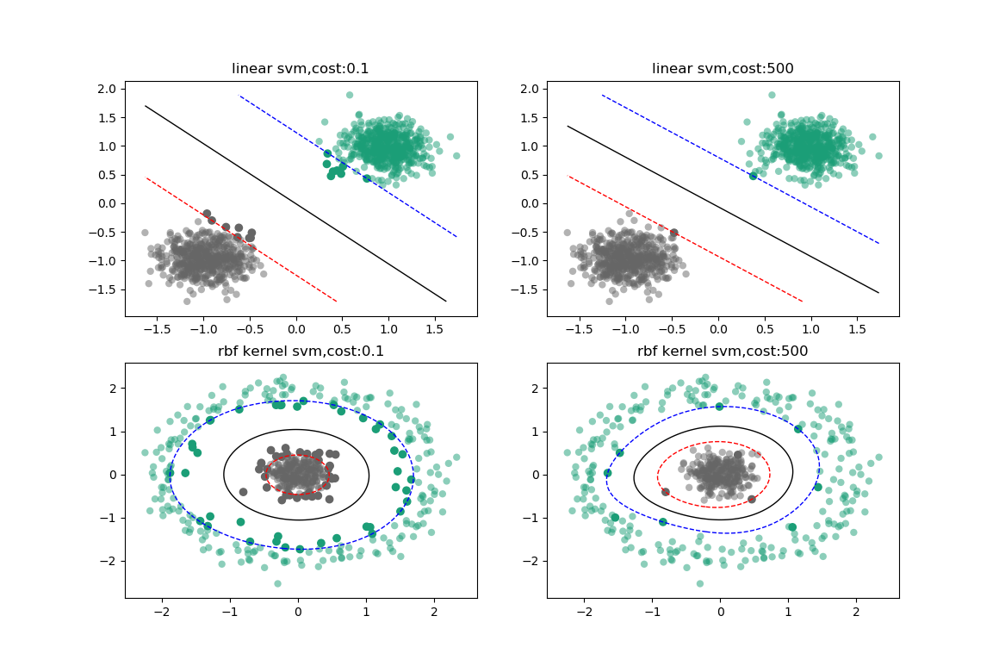

# Machine Learning Algorithm implemented by python

## 1:SMO(Sequential Minimal Optimization)
### Usage:
	from smo import SmoSVM, Kernel
	
	kernel = Kernel(kernel='poly', degree=3, coef0=1, gamma=0.5)
    init_alphas = np.zeros(train.shape[0])
	SVM = SmoSVM(alpha_list=init_alphas, kernel_func=kernel, cost=0.4, b=0.0, tolerance=0.001)
    SVM.fit(train_data)
    predict = SVM.predict(test_samples)
	
### Output:

#### Reference:
> [Fast Training of Support Vector Machinesusing Sequential Minimal Optimization](https://www.microsoft.com/en-us/research/wp-content/uploads/2016/02/smo-book.pdf)

> [Sequential Minimal Optimization: A Fast Algorithm for Training Support Vector Machines](https://www.microsoft.com/en-us/research/wp-content/uploads/2016/02/tr-98-14.pdf)

> [Sequential Minimal Optimization for SVM](http://web.cs.iastate.edu/~honavar/smo-svm.pdf)

> [Implementing a Support Vector Machine using Sequential Minimal Optimization and Python 3.5](https://jonchar.net/notebooks/SVM/)

## 2:Decision Tree
### Usage:
    from decision_tree import DecisionTree
    tree = DecisionTree(criterion='gini', n_features=None, max_depth=20, min_impurity=1e-6)
    tree.fit(train_data)
    prediction = tree.predict(test_data)
    
## 3:Random Forest
### Usage:
    from decision_tree import DecisionTree
    from random_forest import RandomForest
    from smo import Kernel, SmoSVM
    # use cart tree
    tree_args = {'criterion': 'gini', 'n_features': 7, 'max_depth': 15, 'min_impurity': 1e-6}
    rf = RandomForest(DecisionTree, n_trees=100, method='vote', samples_ratio=1.0, oob_estimate=True,model_args=tree_args)
    rf.fit(train_data)
    prediction = rf.predict(test_data)
    print(rf.oob_accuracy)
    # use svm
    mykernel = Kernel(kernel='rbf', degree=5, coef0=1, gamma=0.5)
    svm_args = {'kernel_func': mykernel, 'cost': 0.4, 'b': 0.0, 'tolerance': 0}
    rf = RandomForest(SmoSVM, n_trees=100, method='vote', samples_ratio=1.0, oob_estimate=True,model_args=svm_args)
    rf.fit(train_data)
    prediction = rf.predict(test_data)
